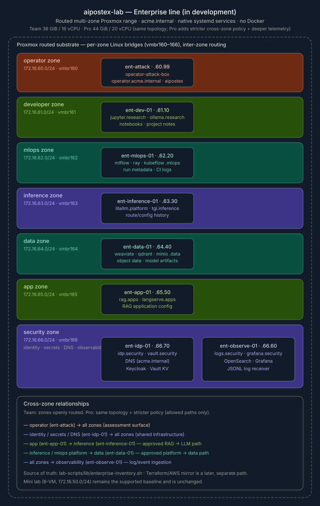

# Enterprise Lab Architecture

!!! warning "In development"

    Enterprise is the next training-range line and is not yet the stable default lab. The mini lab remains the supported baseline while Enterprise Proxmox, Ansible orchestration, native services, and seeded artifacts are validated.

The enterprise lab is a second lab line that grows out of the current 6-VM mini lab without replacing it.

The mini lab stays flat, compact, and demo-friendly. The enterprise lab models a small internal AI organization with routed zones, internal names, identity and secrets infrastructure, observability, and AI services split across team-owned hosts.



*Planned architecture. The diagram reflects the topology defined in `lab-scripts/lib/enterprise-inventory.sh`; see the tables below for the authoritative host, zone, and service details.*

## Tier Model

| Tier | Purpose | Deployment |
|---|---|---|
| Mini | Current 6-VM conference and benchmark lab | Existing Proxmox Bash scripts |
| Enterprise Team | Smaller enterprise topology for training groups | Proxmox scripts plus optional Ansible wrappers |
| Enterprise Pro | Same topology with larger sizing and more operational polish | Proxmox first; AWS mirror later |

Team and Pro share the same topology and service layout. The difference is resource sizing, firewall policy, snapshots, and telemetry depth.

## Resource Model

| Profile | VM RAM Allocation | vCPU Allocation | Intended Use |
|---|---:|---:|---|
| Enterprise Team | 36 GiB | 16 vCPU | Smaller training groups and open routed zones |
| Enterprise Pro | 44 GiB | 20 vCPU | Larger host sizing, stricter policy, deeper telemetry |

Plan for Proxmox host overhead in addition to the VM allocation. A 64 GiB Proxmox host is the practical target for Team. Pro fits in 64 GiB only with little headroom; 96 GiB is the more comfortable target.

## Enterprise Hosts

| Host | Zone | Role | Example Internal Names |
|---|---|---|---|
| `ent-attack` | operator | Attack box | `operator.acme.internal` |
| `ent-dev-01` | developer | Research/developer workstation | `jupyter.research.acme.internal`, `ollama.research.acme.internal` |
| `ent-mlops-01` | mlops | ML platform control plane | `mlflow.mlops.acme.internal`, `ray.mlops.acme.internal`, `kubeflow.mlops.acme.internal` |
| `ent-inference-01` | inference | Inference gateway and model serving | `litellm.platform.acme.internal`, `tgi.inference.acme.internal` |
| `ent-data-01` | data | Vector/object data services | `weaviate.data.acme.internal`, `qdrant.data.acme.internal`, `minio.data.acme.internal` |
| `ent-app-01` | app | AI applications and RAG apps | `rag.apps.acme.internal`, `langserve.apps.acme.internal` |
| `ent-observe-01` | security | Logging and monitoring | `logs.security.acme.internal`, `grafana.security.acme.internal` |
| `ent-idp-01` | security | DNS, identity, and secrets fixtures | `idp.security.acme.internal`, `vault.security.acme.internal` |

## Zones

| Zone | CIDR | Bridge |
|---|---|---|
| operator | `172.16.60.0/24` | `vmbr160` |
| developer | `172.16.61.0/24` | `vmbr161` |
| mlops | `172.16.62.0/24` | `vmbr162` |
| inference | `172.16.63.0/24` | `vmbr163` |
| data | `172.16.64.0/24` | `vmbr164` |
| app | `172.16.65.0/24` | `vmbr165` |
| security | `172.16.66.0/24` | `vmbr166` |

Proxmox provides the routed substrate between zones. Team keeps the zones openly routed. Pro uses the same bridges and hosts, then applies a stricter cross-zone policy that allows operator access, shared identity/secrets/DNS, approved app-to-inference and platform-to-data paths, and observability ingestion.

## Enterprise Infrastructure Services

The enterprise line adds native infrastructure that makes the range feel like a real internal AI environment:

| Host | Infrastructure Role |
|---|---|
| `ent-idp-01` | DNS with `acme.internal` names, Keycloak identity, Vault secrets |
| `ent-observe-01` | OpenSearch, Grafana, and a lightweight JSONL log receiver |
| `ent-data-01` | MinIO object storage plus vector/data services |

These services are installed directly on the VMs and managed with systemd. Docker and Compose are intentionally not part of this track.

## Seeded Enterprise Story

Enterprise seeding creates coherent artifacts across the environment:

- notebooks and project notes on `ent-dev-01`
- Ray and MLflow metadata plus CI logs on `ent-mlops-01`
- LiteLLM route/config history on `ent-inference-01`
- MinIO-style object data and model artifacts on `ent-data-01`
- RAG application configuration on `ent-app-01`
- Vault KV secrets and Keycloak realm/client data on `ent-idp-01`
- representative operator/security events on `ent-observe-01`

The goal is not one vulnerable app. The goal is an enterprise training ground where credentials, internal names, logs, and platform relationships line up.

## Source Of Truth

Enterprise topology is defined in:

```text
lab-scripts/lib/enterprise-inventory.sh
```

The current mini lab inventory remains unchanged in:

```text
lab-scripts/lib/inventory.sh
```

Terraform is not used for Proxmox. The existing Terraform path remains AWS-only and can later mirror the enterprise inventory after the Proxmox version stabilizes.
