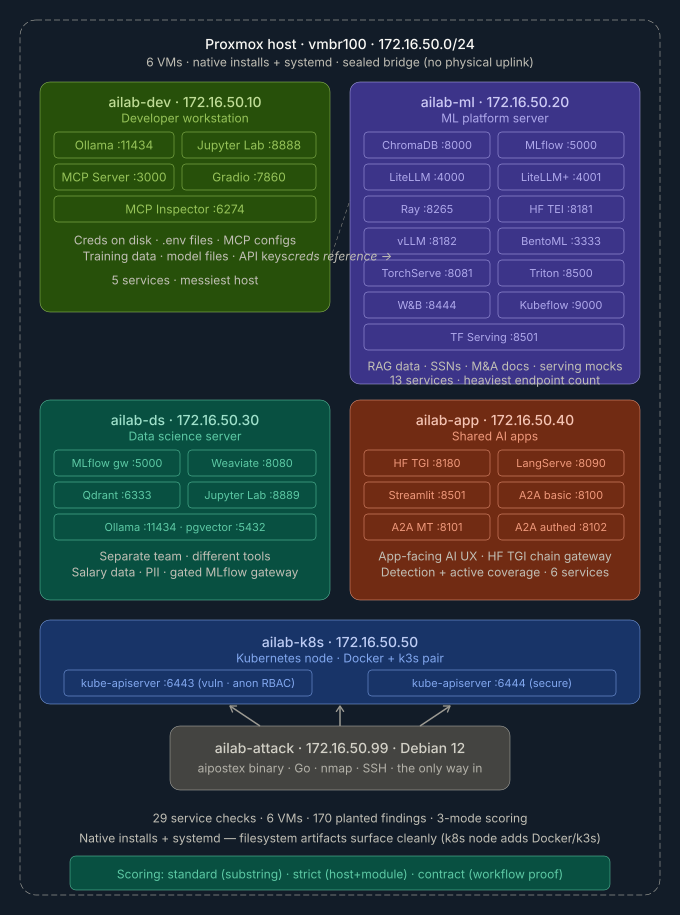

# VM Map

## Virtual Machines

| VM Name | VM ID | IP Address | OS | Role | Ports |
|---|---|---|---|---|---|
| `ailab-dev` | 210 | `172.16.50.10` | Ubuntu 24.04 | Developer workstation | 11434, 8888, 3000, 3002, 7860, 6274 |
| `ailab-ml` | 220 | `172.16.50.20` | Ubuntu 24.04 | ML platform | 8000, 5000, 4000, 4001, 8265, 8181, 8182, 8081, 8082, 8500, 3333, 8444, 9000, 8501 |
| `ailab-ds` | 230 | `172.16.50.30` | Ubuntu 24.04 | Data science | 11434, 8889, 8080, 6333, 5000, 5432, 8091 |
| `ailab-app` | 250 | `172.16.50.40` | Ubuntu 24.04 | Shared AI apps | 8090, 8104, 8110-8113, 8501, 8100-8103, 8180, 8765 |
| `ailab-k8s` | 260 | `172.16.50.50` | Ubuntu 24.04 | Kubernetes node | 6443 (vuln), 6444 (secure) |
| `ailab-attack` | 240 | `172.16.50.99` | Debian 12 | Attack box | SSH |
| `ailab-siem` | 270 | `172.16.50.60` | Ubuntu 24.04 | Detection (Elastic) | 9200, 5601 |

## Service Endpoints

### ailab-dev

- `11434` Ollama
- `8888` Jupyter Lab
- `3000` MCP Server
- `3002` Vulnerable MCP server (sandbox-escape + SSTI targets)
- `7860` Gradio
- `6274` MCP Inspector

### ailab-ml

- `8000` ChromaDB
- `5000` MLflow
- `4000` LiteLLM
- `4001` LiteLLM (authed)
- `8265` Ray
- `8181` HF TEI mock
- `8182` vLLM mock
- `8081` TorchServe mock
- `8082` TorchServe metrics
- `8500` Triton mock
- `3333` BentoML mock
- `8444` W&B mock
- `9000` Kubeflow mock
- `8501` TF Serving mock

(The real HF TGI gateway on `8180` runs on `ailab-app`, not here; `ailab-ml`'s legacy `:8180` mock is opt-in and off by default.)

### ailab-ds

- `5000` MLflow auth gateway (gated — the credential-chain hop)
- `8080` Weaviate
- `6333` Qdrant
- `5432` pgvector
- `8091` Black-box RAG app (knowledge-base chat + document upload)
- `8889` Jupyter Lab
- `11434` Ollama

### ailab-app

- `8090` LangServe
- `8501` Streamlit
- `8100`–`8102` A2A agents (scored mocks); `8103` A2A real agent (offensive target)
- `8104` A2A orchestrator (unauthenticated agent registry — `a2a register` target)
- `8110` Bespoke IT-helpdesk agent (custom `/chat` — target for the `agent` module)
- `8111` Bespoke document-summarizer agent (`/summarize` + `/chat` — indirect injection; timestamp session IDs)
- `8112` Bespoke code-review agent (`/chat` — CI-token in system prompt; **sequential** session IDs)
- `8113` Bespoke browse agent (`/chat` + `/fetch` — SSRF-ish over-reach; short session IDs)
- `8180` HF TGI gateway (real inference)
- `8765` Post-Ex Oracle

### ailab-siem

- `9200` Elasticsearch (cluster `aipostex-detect`)
- `5601` Kibana (Elastic Security — detection engine)
- Persistent detection host (NOT rolled by reset-wave). Beats (Filebeat + Auditbeat) on the target hosts ship here.
- Login: `elastic` — password is set at install via `ELASTIC_PASSWORD` (see operator notes, not committed)

### ailab-k8s

- `6443` Kubernetes API — k3s **vuln** (anonymous RBAC)
- `6444` Kubernetes API — k3s **secure** control

## Host Entries

```text
172.16.50.10  ailab-dev
172.16.50.20  ailab-ml
172.16.50.30  ailab-ds
172.16.50.40  ailab-app
172.16.50.50  ailab-k8s
172.16.50.99  ailab-attack
```

## Network Diagram


